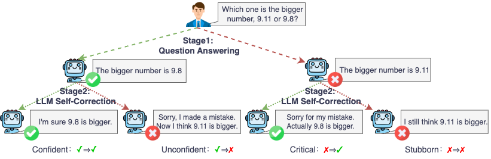

<div align="center">
  <h2><i>Self-Correction Decomposition and Evaluation</i> </h2> 
</div>

- This repo is for paper "Confidence v.s. Critique: A Decomposition of Self-Correction Capability for LLMs"


## Overview
We propose a methodology to decompose, evaluate, and analyze the self-correction capability of LLMs.



**Self-correction Decomposition**: We enumerate the correctness of answers before and after self-correction and analyze four scenarios, 
based on which we decompose the self-correction capability into: 1. confidence capability (maintaining confidence in correct answers) and 2. critique capability (turning wrong answers to correct).

**Self-correction Evaluation**: To measure these two capabilities, we introduce Confidence Level (CL) and Critique Score (CS) from a probabilistic perspective, which respectively represent the conditional probabilities of the model generating a correct answer after self-correction, given the initial answer is correct/incorrect. By analyzing lower and upper bounds of CL and CS, we propose Relative Self-correction Score to measure the overall self-correction capability. 


## Evaluation Metrics
- Accuracy_1 ($Acc_1$): accuracy before self-correction.
- Accuracy_2 ($Acc_2$): accuracy after self-correction.
- Confidence Level ($CL$): conditional probability of a model generating a correct answer after self-correction, given the initial answer is correct.
- Critique Score ($CS$): conditional probability of a model generating a correct answer after self-correction, given the initial answer is wrong.
- Relative Self-correction Score ($RSS$): A normalized form of $Acc_2$ by removing the effect of $Acc_1$

For more details about metrics, please refer to our paper.

## Data

- Evaluation data include [gsm8k](https://github.com/openai/grade-school-math), [IFEval](https://github.com/google-research/google-research/tree/master/instruction_following_eval), [HumanEval](https://github.com/openai/human-eval), [MMLU](https://github.com/hendrycks/test), [BoolQ](https://github.com/google-research-datasets/boolean-questions) and [CommnosenseQA](https://github.com/jonathanherzig/commonsenseqa).
- All test data are in [`data`](./data) directory, and test results are in [`log`](./log) directory.
- Code to check the correctness of an generated answer is in [`check`](./check) directory.


## Environments

All Python packages required to run are listed in `requirements.txt`, and can be installed by:
```
pip install -r requirements.txt
```


## Evaluation

### Answer Generation
The code to generate answers for classification and generation tasks are in `eval_logits.py` and `eval_sampling.py` respectively, and proper arguments should be set before launch:
- `--model_name` the name of evaluated model
- `--model_path` the path to evaluated model (if not specified, model will be downloaded from HuggingFace)
- `--task` the evaluated domain (only `gsm8k`, `humaneval`, `ifeval`, `mmlu`, `boolq`, `commonsense_qa` are supported)
- `--sampling_times` repeated sampling times for one question

For example:

```
python eval_logits.py \
    --model_name llama3_8b_instruct \
    --model_path /local/path/to/your/model \
    --task mmlu

python eval_sampling.py \
    --model_name llama3_8b_instruct \
    --model_path /local/path/to/your/model \
    --task gsm8k \
    --sampling_times 10 \
    --use_vllm 
```

After `bash eval.sh`, answers generated by evaluated model will be stored in [./log](./log).

### Metric Computation
The code to calculate metrics is in `analysis_logits.py` (for classfifcation tasks) and `analysis_sampling.py` (for generation tasks). 

`--model_name` and `--task` should be specified for metric computation. 

For example:

```
python analysis_logits.py \
    --model_name llama3_8b_instruct \
    --task mmlu

python analysis_sampling.py \
    --model_name llama3_8b_instruct \
    --task gsm8k \
    --sampling_times 10
```

We also provide example bash scripts to generate answers and calculate metrics in `eval_logits.sh` and `eval_sampling.sh`


